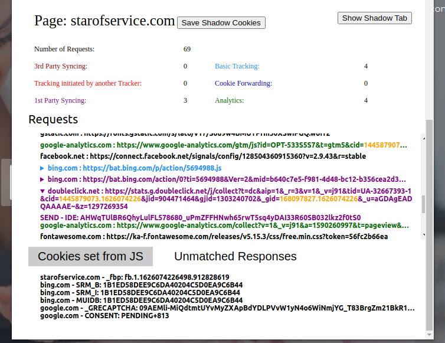

# Ernie Extension
## Extension for Firefox and Chrome to categorize HTTP-request into one of six tracking categories
ERNIE is an open-source browser extension that lets you easily and quickly discover complex tracking techniques on a website.
It is published as part of our WPES'21 paper *Wesselkamp et al. "In-Depth Technical and Legal Analysis of Tracking on Health 
Related Websites with ERNIE Extension." Proceedings of the 20th Workshop on Privacy in the Electronic Society (WPES 2021)*.

Upon a visit to a webpage, the extension analyzes all HTTP-request and categorizes each as non-tracking or into one of six
tracking categories from the [PETS'20 paper](https://arxiv.org/abs/1812.01514) by Fouad et al. [[1]](#1).
This allows the user to get a quick overview over the tracking techniques use by the website. For a more in-depth analysis,
it is optionally possible to save the data in a local database. 

## Installation
It is possible to install the extension from this repository directly, or [here](https://addons.mozilla.org/en-US/firefox/addon/ernie/) for Firefox. We also plan to release the extension Chrome add-on stores. To install the extension, download the release for the correct browser from the 
[release page](https://github.com/vwesselkamp/ernie-extension/releases). 

### [Optional] Set up local database
After analyzing a webpage, the extension will try to write the results to a local mongoDB via [restheart] (https://restheart.org/).
Restheart is a Java Program which exposes a local REST API for a mongoDB instance. If the extension cannot find a local mongoDB instance, it will not try to write to it, and the collected data will be lost when the tab is closed.

Install mongoDB as described in their [documentation](https://docs.mongodb.com/manual/installation/). The default access is admin: secret.

Install [restheart v.5](https://github.com/SoftInstigate/restheart/releases/tag/5.4.6) and run it with Java 11 using `java -jar restheart.jar etc/restheart.yml -e etc/default.properties`.
While Restheart is running, it exposes a rest API of mongoDB, which allows our extension to send data to the DB via local HTTP-requests.
By default, restheart writes to a database within the MongoDB instance called restheart. Either initialize this database 
manually (e.g. in mongoDB compass) or run `curl --user admin:secret -I -X PUT localhost:8080/`
while restheart is running.
The extension then sends data to two collections within that database. These are by default called "extension" and "shadow-tabs", 
but can be changed in the extensions settings. There you can also change the default username and password. Create the collections either manually,
or by running `curl --user admin:secret -I -X PUT localhost:8080/extension`and `curl --user admin:secret -I -X PUT localhost:8080/shadow-tabs`.

We recommend using [mongoDB compass](https://www.mongodb.com/products/compass) to access the collected data.

### Install in Firefox
Go to about:addons -> Manage your extension -> Install extension from file. Select the zip file downloaded from the releases
page.
You will get a warning that it has not been signed, which you can ignore. It is possible you need to go to `about:config` 
and set `xpinstall.signatures.required` to false. You will be asked to allow the extension to hide windows.

### Install in Chrome
Go to chrome://extensions and drag and drop the crx file into the window. The extension should install.
Additionally set the following things:
* Go to chrome://settings/cookies and allow all cookies. The difference to the default mode is that now, in the incognito 
mode, 3rd party cookies can be set by websites. When not using the extension, remember to disable this setting.
* Go to the setting page of the extension. Choose "allow in incognito mode". An incognito window should open in the background
immediately

## How it works
For every visit to a page that you perform while the extension is active, there is a second visit happening in the background, 
in what is called the "shadow tab". This second visit determines which cookies are ID cookies (cookies which can be used to 
track a user).   
The second visit in the "shadow tab" is performed in a different container (in Firefox a "contextual identity", in Chrome
an incognito tab), which has its own cookie store. If we now compare the cookies set in the foreground tab and the ones 
from the shadow tab and we find a cookie with the same key but a different value, we can estimate that this cookie can be used to track you.   

Because the shadow tab is a different container, on visiting a page and accepting the cookie banner, it is also necessary 
to visit the shadow tab and do the same action there (if you want the cookies that are set to be comparable). 

Over time, the "shadow tab" container will populate with cookies that are already set in the main tab. This is important as only
cookies which occur in both main and shadow tab will be compared, and categorized as ID cookies. You can help manually if you want
a specific cookie to be set in the shadow tab by visiting that page (e.g. google.com) and accepting cookies in the shadow tab.

### Building shadow profile in Chrome
Chrome uses the incognito window as a separate cookie store for the shadow tab. Upon closing that incognito window, or s
topping the extension, the cookies in the shadow tab are therefore lost.
If you want to retain the cookies and data build in the shadow container even 
after disabling the extension or closing the browser, you explicitly need to state that.

For this purpose, there is a button called "Save shadow cookies" in the popup. Click it before closing the window. The data
will be saved to the extensions database and loaded into the incognito tab the next time you use the extension.

### The interface:
ERNIEs interface carries a lot of information through color- and font-codes.

At the top of the interface you can see an overview of the counted HTTP-requests and the different tracking categories,
as well as buttons to access the shadow tab and (only in Chrome) to save the cookies from the Shadow container.
Below you see a list of requests, sent upon the visit to this website. Clicking upon one request expands it to show the full
URL, and the cookies associated with the request - either set or send, as can be seen for the purple doubleclick cookie
"IDE".

Below is a list of cookies set not by a HTTP-request, but a Javascript script.

#### Font-codes
For the URLs:
* normal: A first party request
* **bold**: A third party request

For the cookies:
* **bold**: Cookie that is also found in the shadow container and is categorized as an ID cookie
* *italics*: Cookie that is also found in the shadow container and is categorized as a safe cookie (same for all users)
* normal: Cookie that is not found in the shadow container, unknown.

#### Color-codes
The color of the request matches the tracking category it belongs to. Additionally, URL parameters, such as in the image above,
are marked a different color if they are forwarded ID cookies. In the screenshot, doubleclick receives the _ga cookie in the URL 
parameters, which is marked yellow. First party cookies that are forwarded are marked in yellow, third party cookies in orange.
## Notes
The library for the public suffix list is this: https://github.com/lupomontero/psl  
It has last been updated in March 2020. There exist alternatives where you can plug in the current list on your own.

## References
<a id="1">[1]</a>
Fouad et al.
"Missed by Filter Lists: Detecting Unknown Third-Party Trackers with Invisible Pixels."
PETS 2020-20th Privacy Enhancing Technologies Symposium. 2020